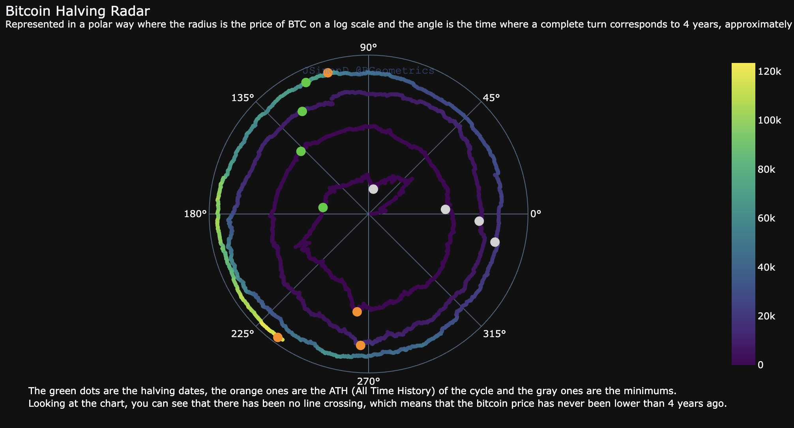

+++
title = "Ne olacak bu BiTCoin?"
date = 2025-08-22T11:33:01+03:00
draft = false
author = "Turgut Şimşek"
comments = false
image = ""
menu = ""
share = false
tags = ["Bitcoin", "BTC", "Fibonacci"]
+++

İşimiz teknoloji ve veri olunca, çoğu kişi Kripto Paralar ve __BTC__ hakkında sorular soruyor. Özellikle fiyatın __ATH__ (All Time High / Tüm zamanların en yükseği) yaptığı bu dönemlerde sorular çok geliyor.

> Finansal piyasaların dinamikleri çok farklı, teknik ve temel analiz anlatacak ya da kahinlik yapacak değilim. Öncelikle; yazının başlığında gördüğünüz, çok eski bir [gök kuşağı grafiğini](https://www.blockchaincenter.net/en/bitcoin-rainbow-chart/) paylaşmak istiyorum. BTC' nin fiyatının nerelere varacağı ve nerelerde aşırı fiyatlanmış ya da ucuz kalmış genel bir çerçeve çiziyor. Sitede daha güncel versiyonunu da görebilirsiniz, bilmiyorsanız bakmanızı tavsiye ederim.
Internet üzerinde Gök Kuşağına benzer bir çok analize ulaşabilirsiniz. Bana BTC sorulduğunda, veriler üzerinden ve BTC' nin teknolojisini göz önüne aldığımda bu analizlerden en bilimsel ve bana göre en tutarlı olanı paylaşıyorum. Bu yazının konusu da bu paylaşım olacak.

__Öncelikle teknolojiye bakalım:__ Bitcoin; adedi 21 milyonla sınırlı ve madenciler tarafından akıllı bir algoritma çözülerek üretilen bloklardan oluşur. Her blok için ciddi bir enerji harcanır. Tıpkı yapay zekanın eğitilmesinde kullanılan işlemci ihtiyacı gibi madenciler de hesaplama kapasitesi yüksek sunucular kullanırlar.

Her yeni blok çıkarıldığında, onu çözen madenciye ödül olarak yeni Bitcoin' ler verilir. Bu, yeni coin' lerin tedavülünü kontrol etmek ve toplam Bitcoin arzını sınırlı tutmak için tasarlanmış Bitcoin protokolünün önemli bir parçasıdır. Madenci ödüllerinin azaltılması, yeni coin' lerin tedavül hızını yavaşlatır ve toplam BTC miktarını 21 milyonla sınırlar.

Yaklaşık 4 yılda bir, her 210.000 blokta bir gerçekleşen ve madencilerin blok zincirine bir blok eklemeleri karşılığında ödüllendirildikleri Bitcoin miktarının yarıya indirildiği planlı bir etkinlik / kod vardır: __Halving!__ (Bitcoin yarılanması)

Her Halving döneminden sonra madencilerin aldığı ödül miktarı yarıya indirildiği için BTC' nin değerinin belirli bir çizgide artması gerektiğini, yoksa sistemin sürdürülemez olduğu görülüyor. Tıpkı fibonacci sayı dizisinde olduğu gibi belirli bir oranda artış göstermesi gerekliliği ortaya çıkıyor.

<figure>
    
    <figcaption style="font-style: italic; color: #666; text-align: center; margin-top: 10px;">
        Fibonacci: Altın Oran, Spiral, Sarmal
    </figcaption>
</figure>

İşte bu noktaları birleştiren [bilimsel bir analiz](https://charts.bgeometrics.com/bitcoin_halving_radar_g.html) var. Aşağıdaki grafikte BTC' nin ilk çıktığı günden itibaren günümüze kadar olan fiyat hareketlerini logaritmik ölçekte baz alarak ve açının tam bir dönüşünün yaklaşık 4 yıla karşılık geldiği bir grafik elde edilmiş.

Grafikte; __Yeşil__ noktalar yarılanma tarihlerini, __Turuncu__ noktalar döngünün ATH'sini (Tüm Zamanların En Yükseği) ve __Gri__ noktalar ise en düşük fiyatları temsil ediyor.

__Grafikteki en önemli detay herhangi bir çizgi kesişimi olmaması.__ Bu da Bitcoin' in varolduğundan günümüze kadar, fiyatının hiç bir zaman 4 yıl öncesinden daha düşük bir seviyede olmadığı anlamına geliyor.

<figure>
    
    <figcaption style="font-style: italic; color: #666; text-align:center; margin-top: 10px;">
        BTC Fibonacci, Altın Oran
    </figcaption>
</figure>

Bu kadar bilgiden sonra stratejimizi nasıl kuracağız ona gelelim:

Ben bu yazıyı yazarken *21/08/2025* BTC' nin fiyatı 112.500$ görünüyor.
Bu grafiğe göre *21/08/2029* yılında BTC fiyatı 112.500$ altında olmayacak. Ayrıca yukarıdaki grafiğe dikkatli bakarsanız BTC' nin bu yıl içindeki değeri bir önceki çizgiye çok yaklaşmış ve sonra teğet geçerek ATH yapmış. Bu grafiğe uygun strateji yapanlar yine kazanmışlar. Bulunduğunuz güne ait geçmiş fiyatları göreceğiniz sayfaya [buradan](https://charts.bgeometrics.com/bitcoin_price_usd_day_g.html) ulaşabilirsiniz.

Yazının başında söylediğim gibi amacımız tahmin ya da kahinlik yapmak değil. Elimizdeki teknoloji ve verilere göre analiz yapmaya çalışarak yolumuzu tayin etmeye çalışmak. Sonuçta paylaştığım sayfa internette __herkese açık__ bir bilgidir. __YATIRIM TAVSİYESİ DEĞİLDİR.__ Yatırımlarınızı, başkalarının görüşlerini alarak değil, kendi bilgi ve birikimlerinizi gözden geçirerek yapmaya özen göstermenizi ve risk yönetimi yapmanızı tavsiye ederim.

BOL KAZANÇLAR!